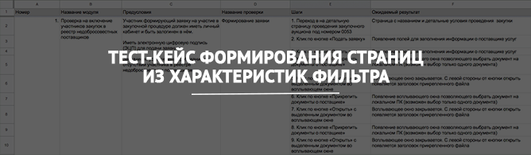

<h2 align="center">
<h2 align="center"><a  href="https://docs.google.com/spreadsheets/d/1gyp73rJnBoykejytFlhcVBs6_UkM__Fm494pdP_rS8w/edit?usp=sharing">Онлайн просмотр в Google Docs</a></h2>
<h2>Описание тест-кейса</h2>

<h4>Условия:</h4>

Интернет-магазин на платформе 1С-Битрикс. При выборе одной из характеристик пункта "Назначение" в фильтре каталога сайта https://bravo.com.ru/catalog/mezhkomnatnye/ формируется дополнительная страница, которая включает:

<ul>
	<li>Заголовки - Title, Description, Keywords;</li>
	<li>Тег - Rel Canonical;</li>
	<li>Тег - h1;</li>
	<li>Текстовое описание под блоком с товарами;</li>
	<li>Формирование ссылки на созданную страницу из фильтра в XML карте сайта.</li>
</ul>

<h4>Реализация:</h4>

<ul>
	<li>Создание заголовков и тегов происходит из административной части сайта. Все заголовки и теги должны быть заполнены;</li>
	<li>При выборе характеристики из пункта "Назначение" любой пользователь должен перейти на сформированную страницу;</li>
	<li>Под блоком с фильтрами после выбора характеристики из пункта "Назначение" должна появиться кнопка "Сбросить".</li>
</ul>

<h4>Задача:</h4>

<ul>
	<li>Составить тест-кейс на проверку функциональности формирования страниц в указанных условиях.</li>
</ul>